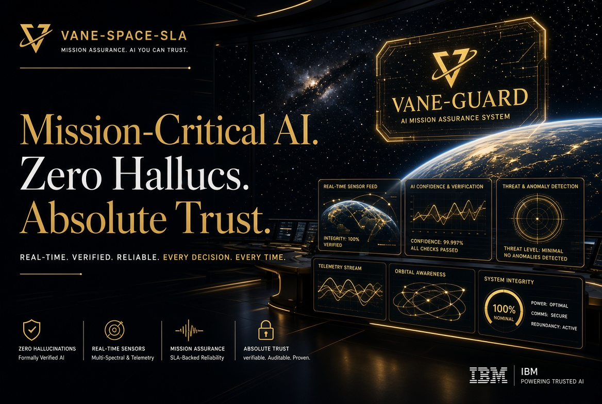

# MD ABUL HOSSAIN – Enterprise Portfolio

**SVP & Head of Strategic Partnerships | TARU Global Access**  
European F&T Expert | IBM Business Partner Plus  
Web of Science Researcher| ORCID

---

### Live Site
- GitHub Pages: [https://anticipatedd.github.io/mdhossain](https://anticipatedd.github.io/mdhossain)

### Overview
This is a production-ready, fully static enterprise portfolio website presenting verified professional achievements, technical credentials, and Horizon Europe related work.

**Key Highlights**
- 67 IBM credentials & training modules
- 58 Microsoft Learn badges + 10 trophies
- AlphaNova Tech Competition: Global Leaderboard #28 | Individual Rank 58/873
- Official EU Publications Office widget & Horizon Europe Pillar II integration
- Interactive credential registries with filtering
- Dedicated architecture modules (M2M OAuth Isolation & Voice Orchestrator)

### Technology
- Pure HTML5, CSS3, Vanilla JavaScript
- No frameworks or build step required
- Fully responsive dark enterprise theme
- Optimized for stability, security and long-term maintainability

### Structure
├── index.html
├── about-us.html
├── contact-us.html
├── privacy.html
├── terms.html
├── security.html
├── style.css
├── animation.script.js
├── registry-controller.js
└── extensions-core/
    ├── m2m-oauth-isolation.html
    └── voice-orchestrator.html

### Deployment
Primary deployment channel: **GitHub Pages** (branch `main`, root directory).  
This ensures continuous availability and clean version history.

### Legitimacy & Compliance
All information presented is accurate and publicly verifiable. The site includes official links to the EU Publications Office and respects professional standards expected of a registered European F&T Expert and Category B Senior Researcher.

---

© 2026 MD ABUL HOSSAIN · TARU Global Access
